# Mermaid Samples

Use this file to verify that Markdown fenced code blocks with `mermaid` render as diagrams.

## Flowchart

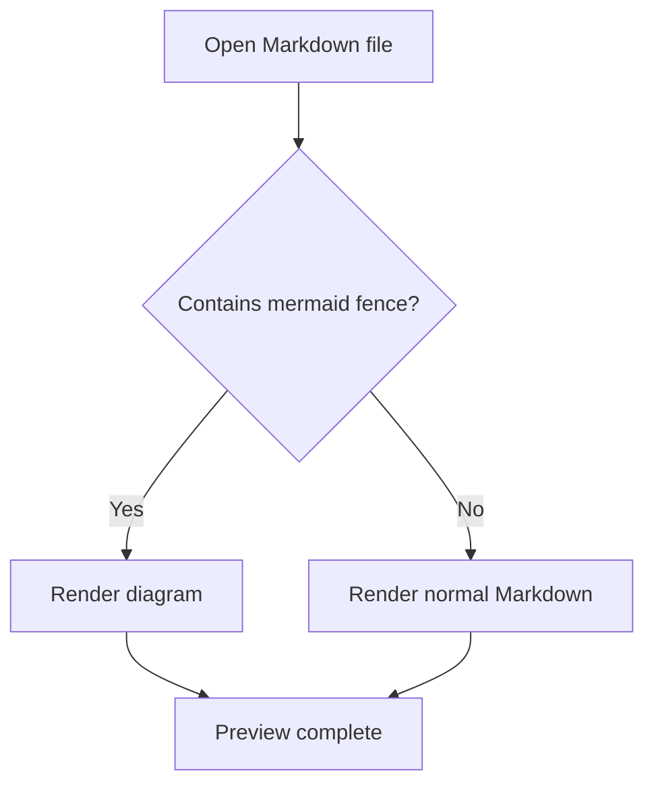

## Sequence Diagram

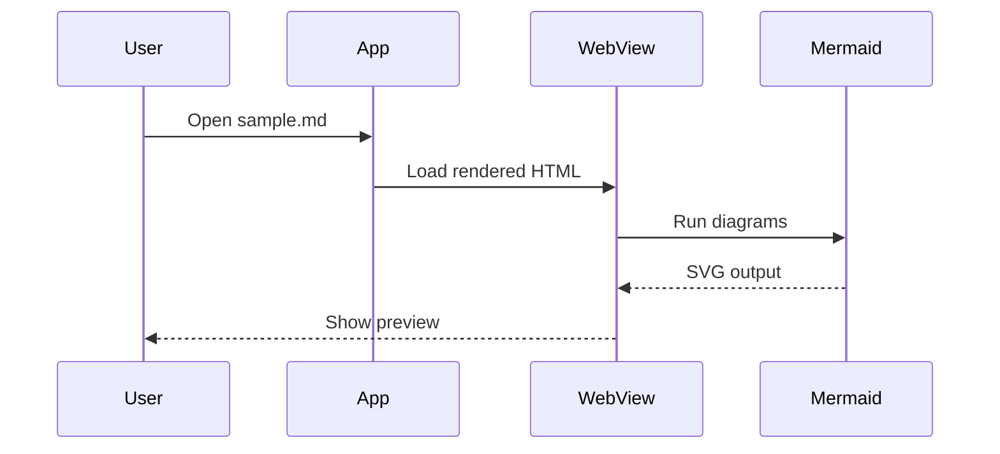

## Class Diagram

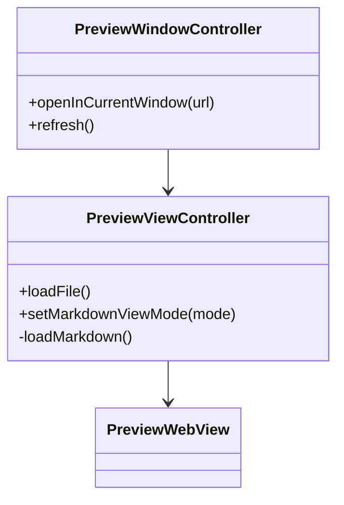

## State Diagram

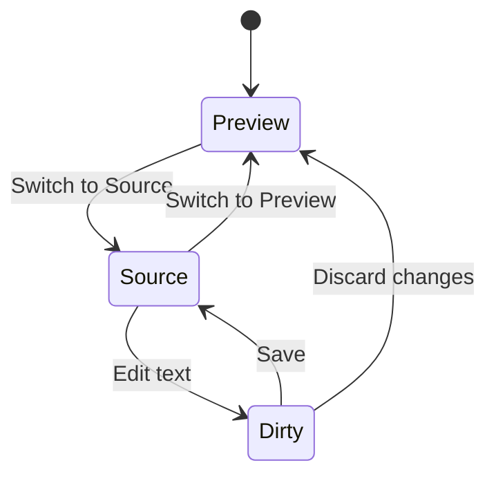

## Entity Relationship Diagram

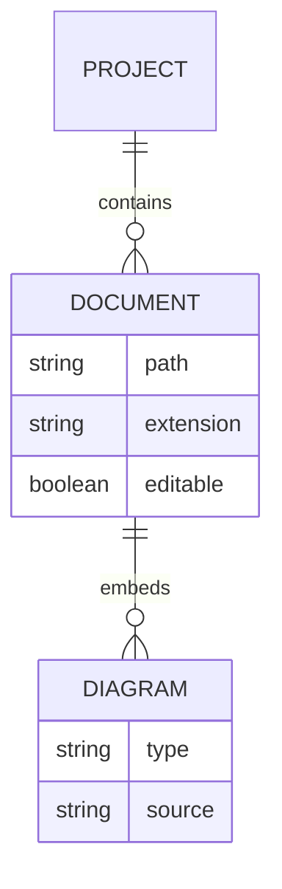

## User Journey

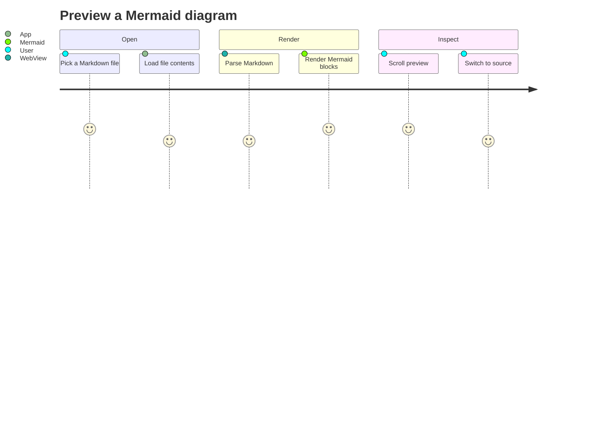

## Gantt Chart

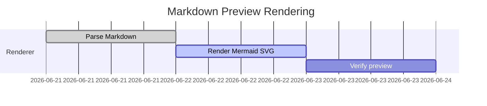

## Pie Chart

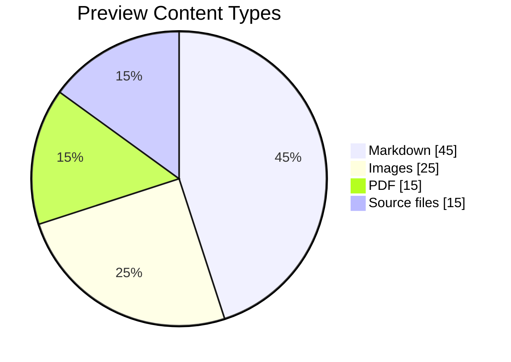

## Git Graph

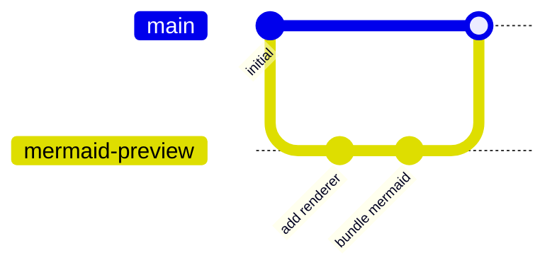

## Requirement Diagram

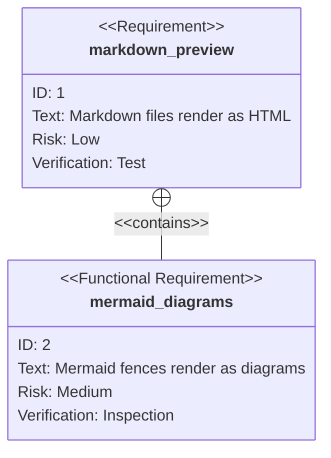

## Mindmap

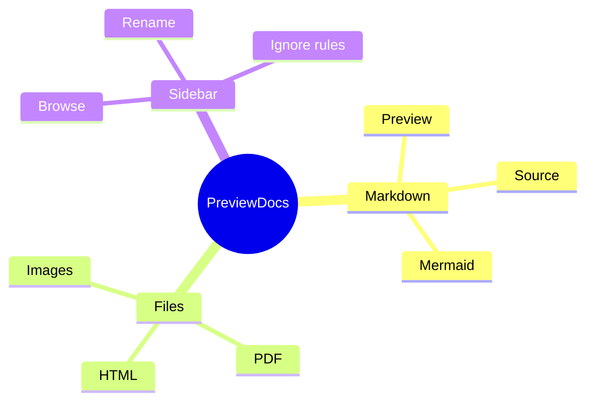
